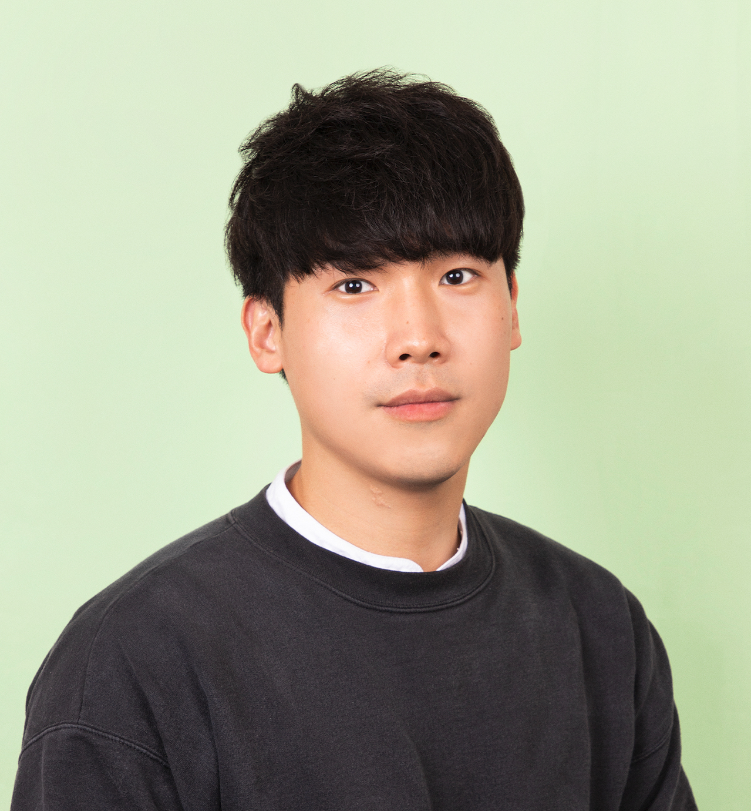

# 4ILab(Integrated Information and Intelligence Imaging Lab)
@Soongsil University, EE

---

# 주요 연구 내용
[Research Interest 🔬](https://sites.google.com/ssu.ac.kr/4ilab/research)
- 인공지능을 활용한 영상 화질 개선 모델 연구
- 데이터 전처리를 통한 인공지능 모델의 성능 개선 연구

## Latest Research Highlight🚨

### Hierarchical decomposed dual-domain deep learning for sparse-view CT reconstruction
Physics in Medicine & Biology (PMB)
[Paper](https://iopscience.iop.org/article/10.1088/1361-6560/ad31c7)

[Yoseob Han](https://github.com/hanyoseob)

---

# [People](https://sites.google.com/ssu.ac.kr/4ilab/people)
## Professor

**[Yoseob Han](https://github.com/hanyoseob), Ph.D. 🎓**

Assistant Professor

IT Convergence Major, Department of Electronic Engineering

Soongsil University

🏢 Room 302, Faculty Research Building

📞 02-828-7150 ✉️ yoseob.han@ssu.ac.kr

## Graduate Researchers 🧑‍🎓👩‍🎓
Coming soon 🙏
## Undergraduate Researchers 👩‍💻🧑‍💻
**[Jungmin Lee](https://github.com/peter8366)**
1. Deepfake detection
2. Medical Image processing

**[Mingyu Kim](https://github.com/hunzo300)**
1. Medical Image processing
2. Object Segmentation

**[Geonwoo Lee](https://github.com/gunwoo5034)**
1. Multi-Modality Learning
2. Medical Image processing

**[Minkyo Jeong](https://github.com/minkyo1015)**
1. CT Reconstruction
2. Medical Image processing

**[Suho Han](https://github.com/unbroken2650)**
1. Diffusion based Segmentation
2. Interactive Segmentation

**[Seyeon Jeong](https://github.com/sysy527)**
1. Multi-Modality Learning
2. Speech Enhancement

## Undergraduate Interns ✏️
**[Geona Lee](https://github.com/kuna00144)**
1. Medical Image processing
2. Object Segmentation

---

# Collaborators
- 서울대학교
- 서울대학교병원
- 한국과학기술연구원
- SSTLabs
- weflo
- purpletalk

---

# Contact
**Office**
🏢 Room 302, Faculty Research Building (연구관)
📞 02-828-7150 ✉️ yoseob.han@ssu.ac.kr

**Laboratory**
🏢 Room 203, Genesis Hall (창의관)